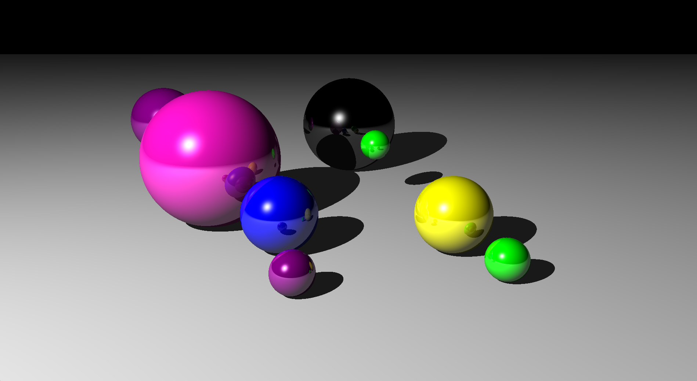

# Java Raytracer

A sophisticated raytracing engine implemented in Java that creates photorealistic 3D renders with features like reflection, shadows, and multiple light sources.



## Features

- **High-Quality Rendering**: Supports 1920x1080 resolution with RGB color output
- **Advanced Lighting**: 
  - Multiple light source support
  - Diffuse and specular reflection
  - Realistic shadow casting
  - Ambient lighting
- **3D Primitives**:
  - Spheres with customizable properties
  - Infinite planes
- **Material System**:
  - Customizable finishes with properties for:
    - Ambient lighting
    - Diffuse reflection
    - Shininess
    - Mirror reflection
  - Support for various colors and materials
- **Camera System**:
  - Configurable camera position and look-at point
  - Adjustable field of view
- **Performance**:
  - Efficient ray-object intersection calculations
  - Optimized shadow calculations
  - Maximum recursion depth control for reflections

## Requirements

- Java Development Kit (JDK) 8 or higher
- Java Runtime Environment (JRE)
- A Java IDE (recommended: IntelliJ IDEA, Eclipse, or VS Code with Java extensions)

## Project Structure

```
RaytracingJava/
├── BaseClasses/
│   ├── Appearance.java     # Material and finish properties
│   ├── Color.java         # RGB color handling
│   ├── Finish.java        # Surface finish properties
│   ├── Material.java      # Base material class
│   ├── Ray.java          # Ray tracing implementation
│   └── Vector3.java      # 3D vector operations
├── SceneObjects/
│   ├── Camera.java       # Camera implementation
│   ├── Light.java        # Light source implementation
│   ├── Scene.java        # Scene management
│   └── Shapes/
│       ├── Shape.java    # Base shape class
│       ├── Sphere.java   # Sphere implementation
│       └── Plane.java    # Plane implementation
├── Main.java             # Application entry point
└── Renderer.java         # Main rendering engine
```

## Getting Started

1. Clone the repository:
```bash
git clone https://github.com/yourusername/RaytracingJava.git
```

2. Open the project in your preferred Java IDE

3. Build and run the `Main.java` file

## Usage

The main entry point (`Main.java`) provides an example scene setup. To create your own scene:

1. Create a new scene with camera and background color:
```java
Camera mainCamera = new Camera(new Vector3(-10, 10, -20), Vector3.ZERO.add(Vector3.UNIT_Y.multiply(4)));
Scene scene = new Scene(mainCamera, Color.Black);
```

2. Define materials and finishes:
```java
Finish shinyFinish = new Finish();
shinyFinish.diffuse = 1;
shinyFinish.shiny = 1;
shinyFinish.reflection = 0.3;
```

3. Add shapes to the scene:
```java
scene.addShape(new Sphere(new Vector3(0, 2, 0), 2, 
    new Appearance(Color.Blue, shinyFinish)));
scene.addShape(new Plane(Vector3.UNIT_Y, 0, 
    new Appearance(Color.White, new Finish())));
```

4. Add lights:
```java
scene.addLight(new Light(new Vector3(-30, 25, -12), Color.White));
```

5. Create a renderer and render the scene:
```java
Renderer renderer = new Renderer(WIDTH, HEIGHT);
renderer.render(scene, callback);
```

## Customization

### Materials and Finishes

The `Finish` class allows you to customize surface properties:
- `ambient`: Ambient light reflection (0-1)
- `diffuse`: Diffuse light reflection (0-1)
- `shiny`: Specular highlight intensity (0-1)
- `reflection`: Mirror reflection amount (0-1)

### Camera Settings

The camera can be positioned and oriented using:
- Location vector: Position of the camera
- Look-at vector: Point the camera is facing
- Field of view: Adjustable through width/height properties

## Contributing

Contributions are welcome! Please feel free to submit a Pull Request.

## License

This project is licensed under the MIT License - see the LICENSE file for details.

## Acknowledgments

- Based on classic raytracing techniques and algorithms
- Inspired by POV-Ray and other raytracing implementations
